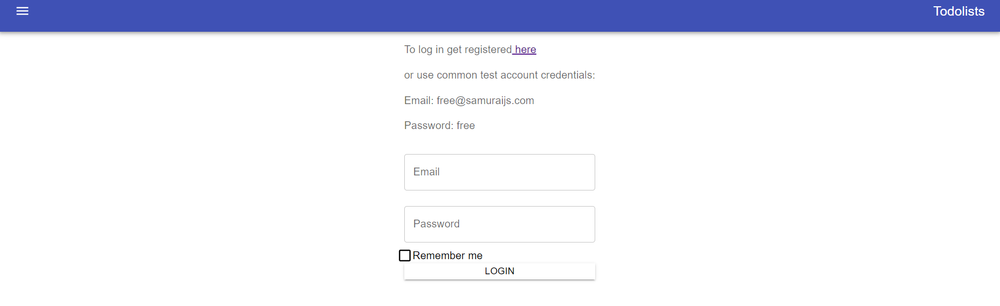
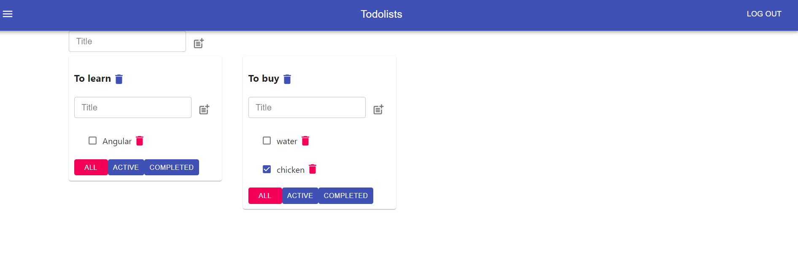

TodoList - a list of tasks that need to be completed, typically organized in order of priority.

Stack: React, Redux, Typescript, Redux-Thunk, Axios, MUI, Formik, Storybook, covering code with unit tests

Currently this project is migrating from Redux to Redux-Toolkit

